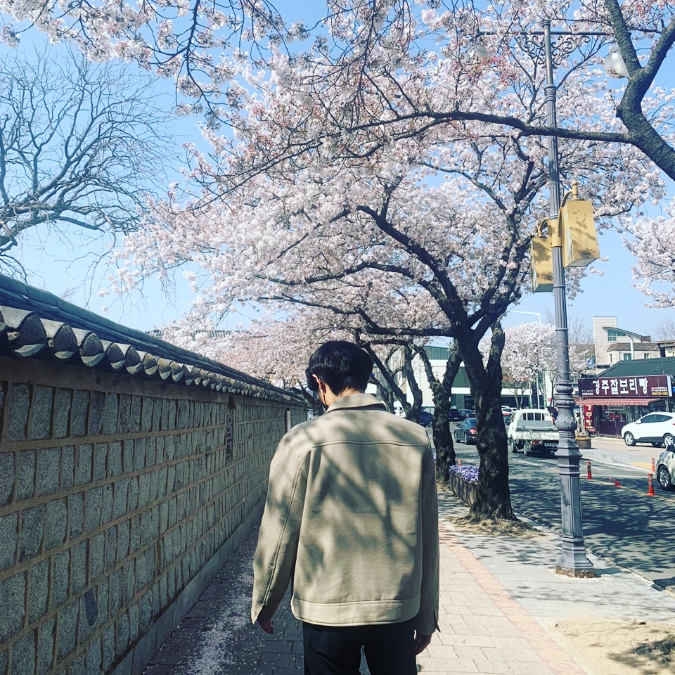

김예준
=============================
**1999년 08월 18일**    
#### 현재 한동대학교 2학년 전산심화 재학 중입니다.     
+ 동아리는 **H-millan**을 하고 있습니다.      
+ 취미는 **축구**입니다.       
+ 경기도 **부천**에 살고 있습니다.   
+ 이메일 주소: ye450450@gmail.com   
+ [github주소](https://github.com/s21900156)    
     

글작성하기 위해 마크다운을 공부해서     
좋은 글들을 작성해 보자.    
이 글의 제목은 {{ page.title }}이고     
마지막 수정 시간은 {{ page.last_modified_at }}이다.
